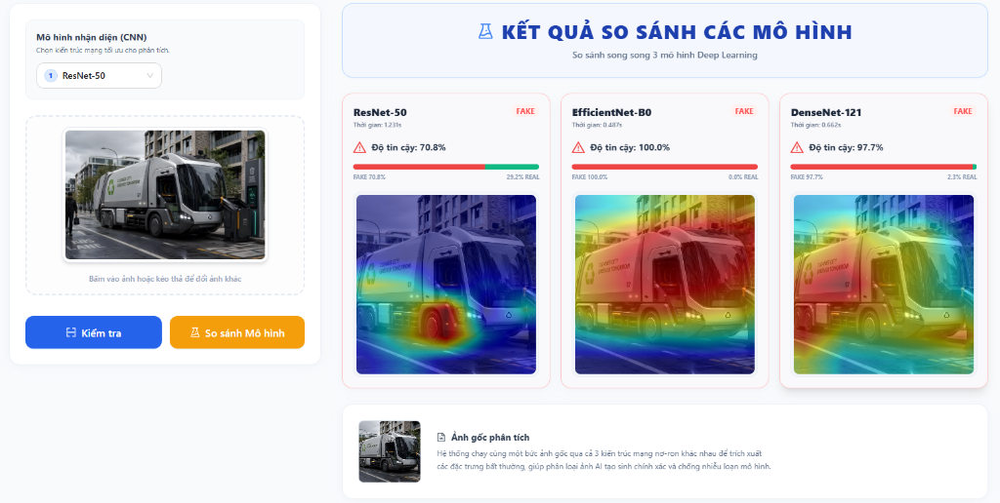

# 🔍 Hệ Thống Phát Hiện Ảnh Ngụy Tạo Do AI Sinh Ra (AI-Generated Image Detection)

[](https://github.com/pdlong4002/ai-image-forgery-detection/actions/workflows/ci.yml)

**Khóa Luận Tốt Nghiệp - Trường Đại học Văn Hiến (2026)**

Đề tài: *Nghiên cứu và phát triển hệ thống phát hiện ảnh ngụy tạo do trí tuệ nhân tạo sinh ra sử dụng Deep Learning kết hợp Explainable Artificial Intelligence (XAI)*

👨‍🎓 **Sinh viên thực hiện:** Phạm Đức Long
👨‍🏫 **Giảng viên hướng dẫn:** Th.S Đặng Văn Lực

---

## 📖 Giới thiệu (Abstract)

Sự bùng nổ của các mô hình Trí tuệ nhân tạo tạo sinh (Generative AI) như Stable Diffusion, Midjourney hay DALL-E đã mang lại những bước tiến vượt bậc trong tổng hợp hình ảnh, nhưng đồng thời làm dấy lên những nguy cơ tiềm ẩn về lừa đảo trực tuyến, tin giả (fake news) và vi phạm bản quyền.

Dự án này tập trung nghiên cứu, xây dựng và đánh giá thực nghiệm một hệ thống tự động phát hiện ảnh ngụy tạo do AI tạo sinh, tích hợp thuật toán Trí tuệ nhân tạo có thể giải thích (Explainable Artificial Intelligence - XAI).
Hệ thống sử dụng kỹ thuật Học chuyển giao (Transfer Learning) trên 3 kiến trúc mạng nơ-ron tiên tiến: **ResNet-50, DenseNet-121, và EfficientNet-B0**, được huấn luyện trên bộ dữ liệu chuẩn mực CIFAKE với quy mô 120.000 hình ảnh.

Để vượt qua rào cản "hộp đen" (black-box) của Deep Learning, dự án tích hợp thuật toán **Grad-CAM (Gradient-weighted Class Activation Mapping)** để trích xuất bản đồ nhiệt (Heatmap), trực quan hóa các vùng điểm ảnh vi mô quyết định đến phán quyết phân loại của mô hình.

## 🖼️ Giao diện hệ thống



## ✨ Tính năng nổi bật

- **Phân loại ảnh thật/giả (Real vs Fake):** Hỗ trợ dự đoán ảnh được tải lên là ảnh tự nhiên (Real) hay do AI sinh ra (Fake) với độ chính xác xuất sắc (>93%).
- **Trực quan hóa XAI với Grad-CAM:** Tự động xuất bản đồ nhiệt (Heatmap) làm nổi bật các khu vực có vết tích ngụy tạo, giúp giải thích lý do tại sao AI lại đưa ra quyết định dự đoán.
- **Giám định Đa mô hình (Multi-model Inference):** Cho phép chạy suy luận song song trên nhiều kiến trúc mạng (ResNet-50, DenseNet-121, EfficientNet-B0) để so sánh và kiểm chứng chéo kết quả theo thời gian thực.
- **Giao diện thân thiện (UI/UX):** Tương tác tải ảnh, chọn mô hình và xem kết quả nhanh chóng, minh bạch thông qua ứng dụng Web (SPA).

## 🛠 Công nghệ sử dụng

Hệ thống được thiết kế theo kiến trúc Client-Server phân tách rõ ràng:

- **AI Core & Training:** Python, PyTorch, Torchvision, OpenCV, thư viện `pytorch-grad-cam`.
- **Backend (API Server):** FastAPI, Uvicorn, Pydantic (Hỗ trợ xử lý bất đồng bộ và suy luận AI siêu tốc).
- **Frontend (Web UI):** ReactJS, Vite, Tailwind CSS, Ant Design, Axios.
- **Triển khai (Deployment):** Docker, Docker Compose.
- **CI/CD:** GitHub Actions (Tự động kiểm thử tiến trình Build Docker khi Push code).

## 📂 Cấu trúc dự án

```text
📦 dl-ai-image-forgery-detection
 ┣ 📂 ai_core/       # Chứa mã nguồn huấn luyện, tiền xử lý data và file trọng số (.pth)
 ┣ 📂 backend/       # FastAPI Server (Xử lý API, AI Inference, trích xuất Grad-CAM)
 ┣ 📂 frontend/      # Mã nguồn ReactJS Web UI
 ┣ 📂 docs/          # Tài liệu báo cáo Khóa luận (PDF), slide thuyết trình
 ┣ 📜 docker-compose.yml # File cấu hình Docker để triển khai toàn bộ hệ thống
 ┣ 📜 .gitignore     # File ignore cấu hình bỏ qua thư mục data, checkpoints, v.v.
 ┗ 📜 README.md      # Tài liệu giới thiệu dự án
```

## 🚀 Hướng dẫn cài đặt và khởi chạy

Hệ thống được thiết kế để linh hoạt triển khai qua môi trường máy chủ cục bộ (Local) hoặc thông qua Docker.

> ⚠️ **Lưu ý về dung lượng:** Quá trình đóng gói bằng Docker sẽ tải xuống các thư viện Học sâu khá nặng (PyTorch, OpenCV) khiến file Image lớn.
>
> - Nếu máy tính của bạn **đã cài đặt sẵn Python và Node.js**, khuyến nghị chạy trực tiếp mã nguồn (Phương pháp 1) để tiết kiệm dung lượng lưu trữ và khởi động nhanh hơn.
> - Nếu máy tính **chưa cài đặt môi trường**, hãy sử dụng Docker Compose (Phương pháp 2) để tự động hóa hoàn toàn và tránh các lỗi xung đột.

### Phương pháp 1: Chạy trực tiếp (Local Execution)

Yêu cầu: Máy tính đã cài đặt Python 3.10+ và Node.js.

1. **Khởi chạy Backend (FastAPI):** Mở terminal tại thư mục `backend`, cài đặt thư viện và chạy server:
   ```bash
   pip install -r requirements.txt
   uvicorn main:app --reload --host 0.0.0.0 --port 8000
   ```
2. **Khởi chạy Frontend (ReactJS):** Mở một terminal khác tại thư mục `frontend`, cài đặt thư viện và khởi chạy:
   ```bash
   npm install
   npm run dev
   ```
3. Truy cập giao diện tại `http://localhost:5173`

### Phương pháp 2: Triển khai với Docker Compose (Khuyến nghị)

Yêu cầu máy tính đã cài đặt Docker và Docker Compose.

1. Mở cửa sổ dòng lệnh (Terminal/Command Prompt) tại thư mục gốc của dự án.
2. Thực thi lệnh xây dựng và khởi chạy vùng chứa (container):
   ```bash
   docker-compose up --build
   ```
3. Truy cập ứng dụng:
   - Giao diện người dùng Web (Frontend): `http://localhost:5173` (hoặc cổng tương ứng cấu hình)
   - Tài liệu API Backend (Swagger UI): `http://localhost:8000/docs`

## 📊 Đánh giá hiệu năng mô hình (Kết quả thực nghiệm)

Kết quả kiểm thử độc lập trên tập 20.000 ảnh từ bộ dữ liệu CIFAKE:

- **EfficientNet-B0:** Đạt hiệu năng tổng thể tốt nhất với Accuracy **93.90%**, F1-Score **93.90%**, ROC-AUC **0.9850**. Tốc độ suy luận siêu nhanh chỉ 8,2 ms/ảnh và dung lượng đóng gói cực nhẹ (~23.1 MB).
- **ResNet-50:** Accuracy **93.50%**, ưu tiên phát hiện tối đa ảnh giả (Recall cao).
- **DenseNet-121:** Accuracy **93.30%**, tối ưu kết nối và tái sử dụng đặc trưng, duy trì tính ổn định.

---

*Khóa luận tốt nghiệp này được hoàn thành với sự nỗ lực nghiên cứu và lòng biết ơn sâu sắc gửi tới giảng viên hướng dẫn cùng khoa Công nghệ Thông tin - Trường Đại học Văn Hiến.*
